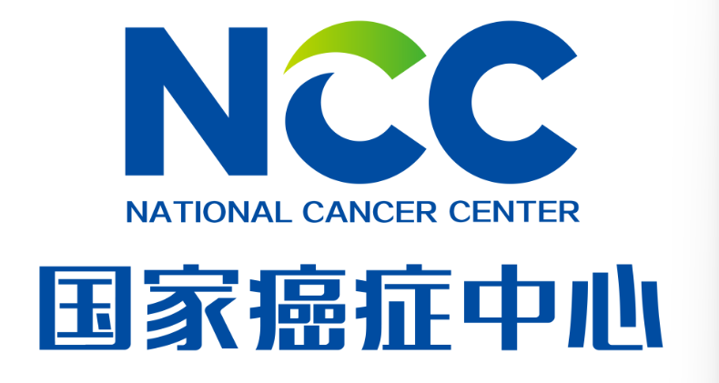
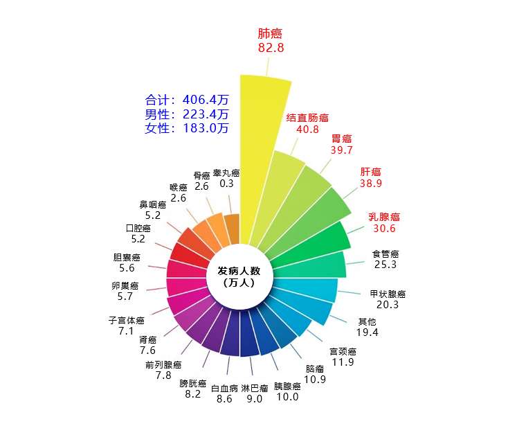
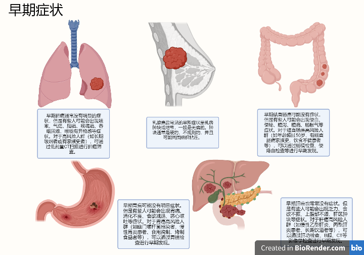
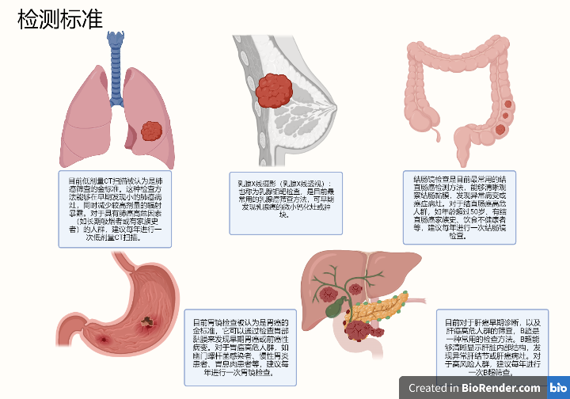
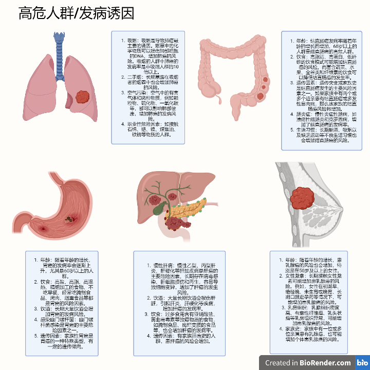
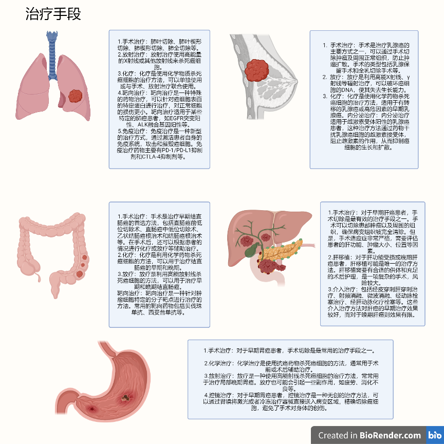

# ai-report
## 结果解读
### 1.阴性0-0.15
#### 结果说明
&emsp;&emsp;当前结果检测癌症风险值为0-0.15，根据[新维度]已有临床研究数据，您的检测结果为阴性，表明我们未从您的血液样本中检测到RNA水平的变异信号，提示目前您罹患结直肠癌，胃癌，肝癌，肺癌此类常见疾病以及泛癌症综合风险评估风险很低，癌症健康水平良好。

### 2.阴性0.15-0.35
&emsp;&emsp;当前结果检测癌症风险值为0.15-0.35，根据[新维度]已有临床研究数据，您的检测结果为阴性，表明我们未从您的血液样本中检测到明显的RNA水平的变异信号，提示目前您罹患结直肠癌，胃癌，肝癌，肺癌此类常见疾病以及泛癌症综合风险评估风险较低，癌症健康水平较良好，但是仍有一定风险，建议定期进行防癌筛查。

### 3.弱阳性0.35-0.5
&emsp;&emsp;当前结果检测癌症风险值为0.35-0.5，根据[新维度]已有临床研究数据，您的检测结果为弱阳性，表明我们从您的血液样本中检测到RNA水平的变异信号，提示目前您存在罹患结直肠癌，胃癌，肝癌，肺癌此类常见疾病以及泛癌症综合风险，建议根据检测报告结果到医院及时进行相关癌症的精确检测，具体说明参考本报告【认识癌症】部分。

### 4.弱阳性0.5-0.65
&emsp;&emsp;当前结果检测癌症风险值为0.5-0.65，根据[新维度]已有临床研究数据，您的检测结果为弱阳性，表明我们从您的血液样本中检测到RNA水平的变异信号，提示目前您存在罹患结直肠癌，胃癌，肝癌，肺癌此类常见疾病以及泛癌症综合风险，建议根据检测报告结果到医院及时进行相关癌症的精确检测，具体说明参考本报告【认识癌症】部分。

### 5.阳性0.65-0.85
&emsp;&emsp;当前结果检测癌症风险值为0.65-0.85，根据[新维度]已有临床研究数据，您的检测结果为阳性，表明我们未从您的血液样本中检测到明显的RNA水平的变异信号，提示目前您罹患结直肠癌，胃癌，肝癌，肺癌此类常见疾病以及泛癌症综合风险评估风险高，癌症健康水平低，我们建议您及时到医院就诊，遵照医嘱进行治疗。

### 6.阳性0.85-1.0
&emsp;&emsp;当前结果检测癌症风险值为0.85-1.0，根据[新维度]已有临床研究数据，您的检测结果为阳性，表明我们未从您的血液样本中检测到明显的RNA水平的变异信号，提示目前您罹患结直肠癌，胃癌，肝癌，肺癌此类常见疾病以及泛癌症综合风险评估风险很高，癌症健康水平很低，我们建议您及时到医院就诊，遵照医嘱进行治疗。
#### 数值说明
阴性:0<肿瘤信号强度<0.35;弱阳性:0.35<肿瘤信号强度<0.65;阳性:0.65<肿瘤信号强度<1.0,肿瘤信号强度根据血液中癌症相关RNA信号强度计算得到，与癌症进程没有定量的线性关系
#### 分析指标
基于中国人群特征数据，大数据分析cfRNA中与肿瘤细胞相关的基因特征，从选择性剪接，嵌合基因，单核苷酸多态性，基因表达水平，等位基因特异性表达，RNA编辑这六个维度经过及其计算得到一个稳定的判定标准：肿瘤信号强度。
&nbsp;&nbsp;

## 相关健康知识和建议
### 4. 认识癌症
#### 1.什么是癌症
##### 癌症的定义
&emsp;&emsp;癌症是一类恶性肿瘤的统称，是指一种由于机体某些细胞不断异常增生，最终形成的肿瘤，它可以侵犯身体的各个部位，并可能通过血液或淋巴系统扩散到其他组织和器官。癌症是一种复杂的疾病，它可能由多种因素引起，包括遗传、环境和生活方式等因素，同时也具有一定的可预防性、可治疗性和可控性。——世界卫生组织
##### 癌症给我们的生活带来的影响

#### 2.我们身边的癌症

&emsp;&emsp;根据2022年国家癌症中心发表的全国癌症报告，截止2016年，全国肿瘤登记中心汇总的数据结果显示，我国单年癌症新发病例达到了406.4万，平均每10万人患癌症约290人，高于每10万人患病186.46人的世界平均标准，癌症患病年龄峰值在60-79岁之间，作为一种疾病，癌症已经严重威胁到了我国居民，尤其是老年人的生命健康，

《2022年全国癌症报告》——国家癌症中心

&emsp;&emsp;数据显示，中国人最常见的高位癌症根据患者数量依次为肺癌，结直肠癌，胃癌，肝癌，乳腺癌等, 让我们简单认识一下这几种癌症。
&nbsp;&emsp;&emsp;早期发现是治疗癌症的关键。对于高风险人群，如果能够通过身体的异常及早发现癌症病情，可以极大的提高基于概率，同时，可以通过**定期体检和筛查**来进行早期发现，及时进行治疗。
&nbsp;
&nbsp;&emsp;&emsp;癌症检测是通过各种医疗测试手段检测人体是否患有癌症的过程。癌症检测旨在早期发现癌症，以便更早地开始治疗。这对于提高癌症治愈率和生存率非常重要。现代医学为我们提供了准确地癌症检测方法。
&nbsp;
&nbsp;&emsp;&emsp;癌症是一种多因素疾病：癌症的发生不仅仅是由于单一因素，而是由于多种因素的综合作用。包括环境因素、遗传因素、生活方式等。因此，符合发病诱因的人/高危人群更加容易患上癌症，更需要及时进行癌症筛查。
&nbsp;
&nbsp;&emsp;&emsp;虽然癌症是一种可怕的疾病，但是并非是不可治愈的，在现代医学的支持下，如果筛查和发现及时，早期的癌症已经有了相当有效，治愈率极高的的治疗方式。
&nbsp;

#### 3.如何远离癌症——生活小建议
&nbsp;
***健康饮食**：均衡饮食对预防癌症非常重要。建议多吃蔬菜、水果、全谷物、豆类等富含纤维素和维生素的食物，少吃肉类和高热量、高脂肪、高糖分的食品。

***健康生活方式**：保持健康的生活方式也是预防癌症的重要措施，包括戒烟、限酒、保持适度运动、保持健康的体重等。

***预防感染**：一些癌症的发生与感染有关。因此，预防感染也是预防癌症的一种手段，包括接种疫苗、保持个人卫生等。

***定期体检**：定期体检可以早期发现癌症，增加治愈率和生存率。建议女性每年进行乳腺、宫颈等癌症的筛查，男性每年进行前列腺癌的筛查。**早筛是关键！**

***减少接触致癌物质**：尽量避免接触致癌物质，如化学品、辐射、某些化妆品和食品添加剂等。
总之，预防癌症需要采取多种综合措施，包括健康饮食、健康生活方式、预防感染、定期体检等。这些措施不仅有助于预防癌症，还有助于保持身体健康。

&nbsp;
**最后，祝愿您远离癌症，健康长寿。**
