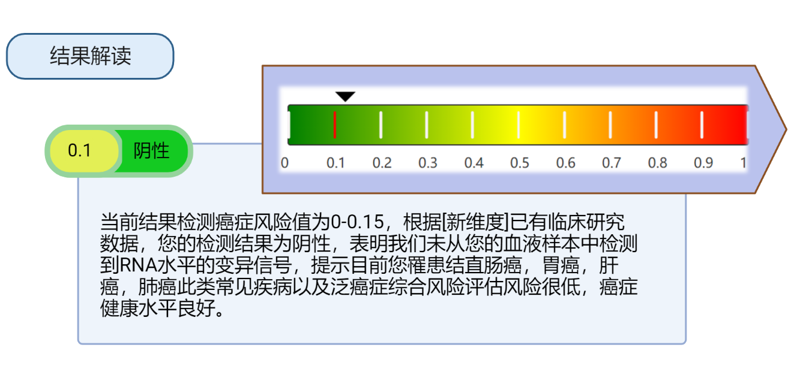
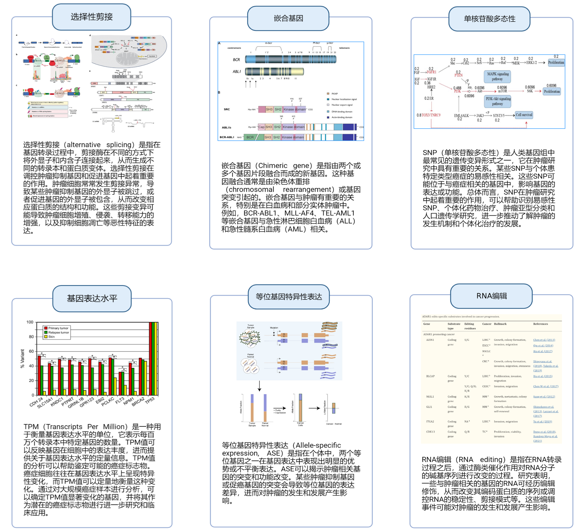
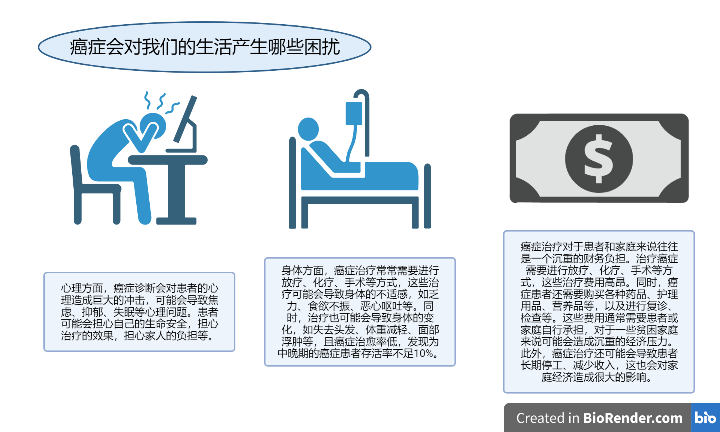

# ai-report
## 结果解读
### 1.阴性0-0.15
#### 结果说明

&emsp;&emsp;当前结果检测癌症风险值为0-0.15，根据[新维度]已有临床研究数据，您的检测结果为阴性，表明我们未从您的血液样本中检测到RNA水平的变异信号，提示目前您罹患结直肠癌，胃癌，肝癌，肺癌此类常见疾病以及泛癌症综合风险评估风险很低，癌症健康水平良好。（图片示例如下，正在尝试通过html自动生成图片插入到markdown中，现在还未实现）

#### 数值说明
阴性:0<肿瘤信号强度<0.35;弱阳性:0.35<肿瘤信号强度<0.65;阳性:0.65<肿瘤信号强度<1.0,肿瘤信号强度根据血液中癌症相关RNA信号强度计算得到，与癌症进程没有定量的线性关系
#### 分析指标
基于中国人群特征数据，大数据分析cfRNA中与肿瘤细胞相关的基因特征，从选择性剪接，嵌合基因，单核苷酸多态性，基因表达水平，等位基因特异性表达，RNA编辑这六个维度经过及其计算得到一个稳定的判定标准：肿瘤信号强度。
&nbsp;&nbsp;&nbsp;

&nbsp;&nbsp;&nbsp;
#### 申明
1.此项目检测结果仅对本次送检样本有效，新维度基因将对检测者的个人信息和送检样本信息严格保密。  

2.此项目检测结果不能作为您是否患有癌症的诊断依据，仅供临床治疗参考。
## 相关健康知识和建议
### 4. 认识癌症
#### 1.什么是癌症
##### 癌症的定义
&emsp;&emsp;癌症是一类恶性肿瘤的统称，是指一种由于机体某些细胞不断异常增生，最终形成的肿瘤，它可以侵犯身体的各个部位，并可能通过血液或淋巴系统扩散到其他组织和器官。癌症是一种复杂的疾病，它可能由多种因素引起，包括遗传、环境和生活方式等因素，同时也具有一定的可预防性、可治疗性和可控性。——世界卫生组织
##### 癌症给我们的生活带来的影响

#### 2.我们身边的癌症

（新图片正在制作）

#### 3.如何远离癌症——生活小建议
&nbsp;
***健康饮食**：均衡饮食对预防癌症非常重要。建议多吃蔬菜、水果、全谷物、豆类等富含纤维素和维生素的食物，少吃肉类和高热量、高脂肪、高糖分的食品。

***健康生活方式**：保持健康的生活方式也是预防癌症的重要措施，包括戒烟、限酒、保持适度运动、保持健康的体重等。

***预防感染**：一些癌症的发生与感染有关。因此，预防感染也是预防癌症的一种手段，包括接种疫苗、保持个人卫生等。

***定期体检**：定期体检可以早期发现癌症，增加治愈率和生存率。建议女性每年进行乳腺、宫颈等癌症的筛查，男性每年进行前列腺癌的筛查。**早筛是关键！**

***减少接触致癌物质**：尽量避免接触致癌物质，如化学品、辐射、某些化妆品和食品添加剂等。
总之，预防癌症需要采取多种综合措施，包括健康饮食、健康生活方式、预防感染、定期体检等。这些措施不仅有助于预防癌症，还有助于保持身体健康。

&nbsp;  

**最后，祝愿您远离癌症，健康长寿。**
